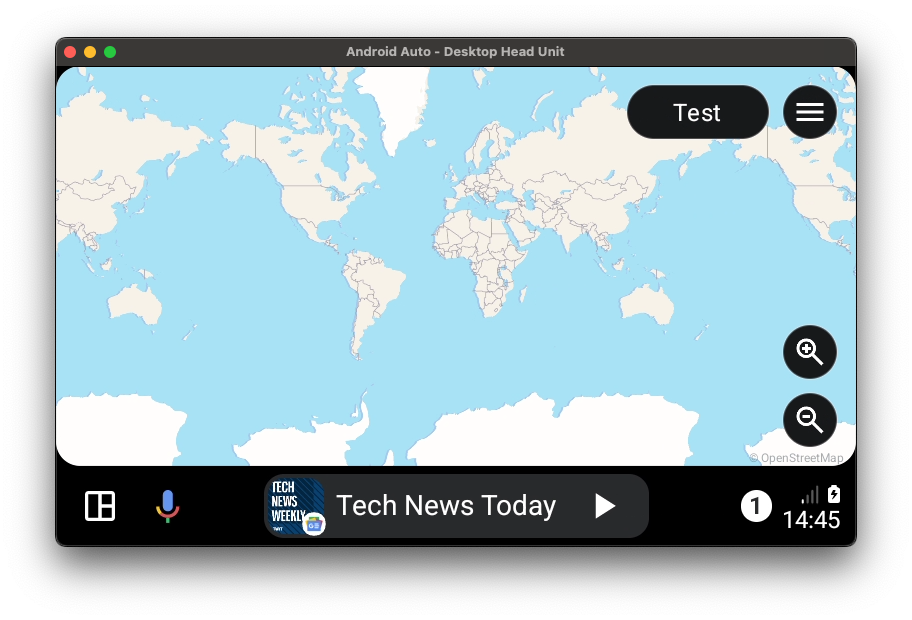

MapLibre Sample app for Android Auto and Automotive
===================================================

This sample app will demonstrate how to use MapLibre on Android Auto and Android Automotive.
(Also known as AAOS, Android for Cars)



So how does this work?
----------------------
Android Auto uses a Template system. It will not allow you to use regular views.
MapLibre will provide the map as a View. If we want to use this MapView on Android Auto, we have to render it on the provided Surface.
See also: https://developer.android.com/training/cars/apps#declare-surface-permission

To get the MapView to render on the surface, we do the following;
We render the MapView offscreen, create a 'screenshot' of this view. 
And we'll draw this Bitmap to the Surface via a Canvas.
Repeat the process 30 times per second, and you've got a working MapView on Android Auto.

This process is not very efficient, but this is what we got to work with.
Maybe in the future, we can find a solution to make MapLibre draw directly unto the Surface,
and thereby skip the workaround. Which is drawing a Bitmap on a Canvas.


How is the code structured?
---------------------------
The map can be drawn on Android Auto, and Android Automotive. A lot of code (most of it), can be shared between the two.
Therefore, this bulk of the code is in a shared module, called `car_common`. This is used by the `app` (Smartphone app, uses Android Auto) and the `automotive` module.
The `automotive` module actually has no code at all, just some config and resources. Everything it uses comes from the `car_common` module.

```mermaid
flowchart TD
    A[car_common] 
    B[app]
    C[automotive]
    
    B --> A
    C --> A
```


Enough words; Show me the code!
-------------------------------

We have a class called `CarMapContainer`, this will take car of the MapView code;  
This is create the MapView, enable textureMode, and add to the WindowManager. 
This is needed to make sure the MapView will render, and makes sure we can get the Texture later for rendering it onto the Canvas.
```kotlin
val mapView = MapView(carContext, MapboxMapOptions.createFromAttributes(carContext).apply {
    // Set the textureMode to true, so a TextureView is created
    // We can extract this TextureView to draw on the Android Auto surface
    textureMode(true)
}).apply {
    setLayerType(View.LAYER_TYPE_HARDWARE, Paint())
}
//(...)
carContext.windowManager.addView(
    mapView /* the MapView */,
    getWindowManagerLayoutParams()
)
```

Furthermore, we have a class called `CarMapRenderer`, this will render the Map on the provided Surface.
```kotlin
//Make sure to get the Surface by registering as SurfaceCallback
override fun onCreate(owner: LifecycleOwner) {
    super.onCreate(owner)
    try {
        carContext.appManager.setSurfaceCallback(this) //Make sure we get the Surface from Android Auto
    } catch (e: Exception) {
        Log.e(LOG_TAG, "Could not set surface callback", e)
        return
    }
}

//In onSurfaceAvailable, we get the Surface onto which we need to draw the map
override fun onSurfaceAvailable(surfaceContainer: SurfaceContainer) {
    Log.v(LOG_TAG, "CarMapRenderer.onSurfaceAvailable")
    this.surfaceContainer = surfaceContainer
    mapContainer.setSurfaceSize(surfaceContainer.width, surfaceContainer.height)

    runOnMainThread {
        // Start drawing the map on the android auto surface
        uiHandler.removeCallbacksAndMessages(null)
        uiHandler.post { drawOnSurfaceRecursive() }
    }
}

//30 times a second, we draw the Map onto the Surface
private fun drawOnSurfaceRecursive() {
    val drawingStart = SystemClock.elapsedRealtime()
    drawOnSurface()
    val drawingDelay = max(DRAWING_INTERVAL - (SystemClock.elapsedRealtime() - drawingStart), 0L)
    uiHandler.postDelayed(::drawOnSurfaceRecursive, drawingDelay)
}

//Using a canvas, draw the map
private fun drawOnSurface() {
    val mapView = mapContainer.mapViewInstance ?: return
    val surface = surfaceContainer?.surface ?: return
    val canvas = surface.lockHardwareCanvas()
    drawMapOnCanvas(mapView, canvas)
    surface.unlockCanvasAndPost(canvas)
}

//The actual drawing of the map
private fun drawMapOnCanvas(mapView: MapView, canvas: Canvas) {
    val mapViewTextureView = mapView.takeIf { it.childCount > 0 }?.getChildAt(0) as? TextureView
    mapViewTextureView?.bitmap?.let {
        canvas.drawBitmap(it, 0f, 0f, null)
    }
}

```

Help! I don't see any MapTiles!
-------------------------------

That's correct, you can fix this by setting your own Style.
Set this in the following places:

Set you own Style in: `CarMapContainer.kt` (car_common);
```kotlin
getMapAsync {
    mapViewInstance = this
    mapboxMapInstance = it
    it.setStyle(
        //TODO: Set your own style here
        Style.Builder().fromJson(ResourceUtils.readRawResource(carContext, R.raw.local_style))
    )
}
```
And in `MainActivity` (app);
```kotlin
private fun initMap(map: MapboxMap) {
    try {
        map.setStyle(
            //TODO: Set your own style here!
            Style.Builder().fromJson(ResourceUtils.readRawResource(this, R.raw.local_style))
        )
    } catch (e: Exception) {
        Log.e("MapLibreCar", "Error setting local style", e)
    }
}
```